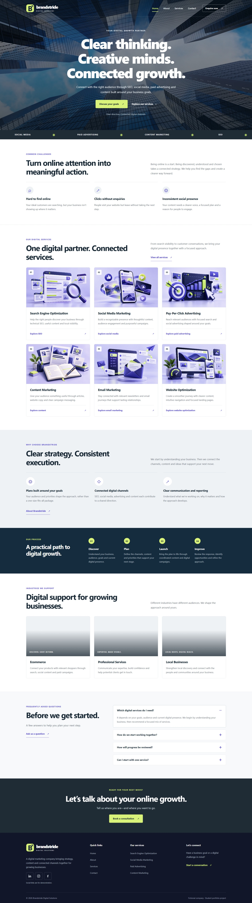

# Brandstride Digital Solutions

**Live website:** [brandstride-digital-solutions-i8cu.vercel.app](https://brandstride-digital-solutions-i8cu.vercel.app/)

A responsive, four-page website for a fictional digital marketing company, built for **Week 2 — Task 1: Responsive Company Website**.

The project presents the company's identity and services and lets visitors complete contact and enquiry forms with client-side validation.

## Assignment overview

| Requirement | Implementation |
| --- | --- |
| Home page | Video hero, service overview, business challenges, process, industries and calls to action |
| About page | Company story, mission, vision, values, team and working process |
| Services page | SEO, social media, paid advertising, content marketing, email marketing and website optimization |
| Contact page | Contact information, project enquiry form and frequently asked questions |
| Responsive layout | Shared layouts with dedicated responsive CSS and a mobile navigation menu |
| Form validation | HTML validation combined with JavaScript trimming, validation feedback and demo confirmation |
| Frontend technologies | HTML5, CSS3 and vanilla JavaScript |

## Features

- Consistent navigation and footer across all four pages.
- Mobile menu with updated ARIA state, Escape support, outside-click dismissal and reset on viewport changes.
- Looping, muted hero video.
- Shared “Enquire now” modal built with the native HTML `dialog` element, including keyboard dismissal and focus restoration.
- Contact and modal enquiry forms with required-field and email validation.
- Service preselection through URLs such as `contact.html?service=seo`.
- FAQ accordions that keep one item open within each group.
- Services feedback carousel with previous/next buttons, pagination and play/pause controls.
- Carousel rotation pauses on hover, keyboard focus and hidden browser tabs.
- Scroll reveals using IntersectionObserver, with reduced-motion support.
- Skip-to-content links, labelled form controls and live status messages.
- Lazy loading for supporting images and an automatically updated copyright year.

## Technologies

- **HTML5:** semantic page structure, forms, details/summary and dialog.
- **CSS3:** reusable styles, responsive layouts and animations.
- **JavaScript:** DOM events, validation, navigation, modal behaviour and carousel controls.

No package installation or build step is required.

## Repository structure

| Path | Purpose |
| --- | --- |
| `index.html` | Home page |
| `about.html` | About page |
| `services.html` | Services page |
| `contact.html` | Contact page |
| `Css/style.css` | Shared and page-specific styling |
| `Css/responsive.css` | Responsive styling |
| `js/script.js` | Shared interactions and form validation |
| `js/services.js` | Services feedback carousel |
| `images/` | Website images |
| `video/hero-city.mp4` | Home hero video |
| `screenshots/` | Desktop, tablet and mobile page screenshots |

## Run locally

1. Download the repository using **Code → Download ZIP**, then extract it, or clone it:

   ```bash
   git clone https://github.com/Shwetaleena-Kundu/brandstride-digital-solutions.git
   ```

2. Open the project folder in VS Code.
3. Open `index.html` with Live Server, or directly in a modern browser.
4. Use the navigation to visit the other pages.


## Forms and API scope

This is a frontend demonstration. Successful submission means the input passed validation; **no message is sent, stored or emailed**. The forms reset and show a message explaining this behaviour.

There is no backend, database or API endpoint in this repository, so API documentation is not applicable to this implementation. Social links and sample feedback are demonstration content; Brandstride is a fictional company.

## Screenshots

Screenshots for all four pages are included at desktop, tablet and mobile sizes.

| Page | Desktop | Tablet | Mobile |
| --- | --- | --- | --- |
| Home | [View](screenshots/home-dektop.jpeg) | [View](screenshots/home-tablet.jpeg) | [View](screenshots/HOME-MOBILE.jpeg) |
| About | [View](screenshots/about-desktop.jpeg) | [View](screenshots/about-tablet.jpeg) | [View](screenshots/about-mobile.jpeg) |
| Services | [View](screenshots/services-desktop.jpeg) | [View](screenshots/services-tablet.jpeg) | [View](screenshots/services-mobile.jpeg) |
| Contact | [View](screenshots/contact-desktop.jpeg) | [View](screenshots/contact-tablet.jpeg) | [View](screenshots/contact-mobile.jpeg) |

### Home preview



## Manual review checklist

- Visit all four pages and follow navigation and service links.
- Check desktop, tablet and mobile layouts for overflow and readability.
- Open and close the mobile menu using the button, Escape and an outside click.
- Open the enquiry popup, close it and check that keyboard focus returns correctly.
- Submit empty, invalid-email and valid form inputs.
- Confirm that valid submissions show the demo-only message.
- Use FAQ controls and every feedback carousel control.
- Check images, stylesheets and the hero video after deployment.

This checklist describes checks to perform; it is not a claim of completed browser testing.

## Live deployment

Hosted on Vercel: [Visit Brandstride Digital Solutions](https://brandstride-digital-solutions-i8cu.vercel.app/).

## Author

**Shwetaleena Kundu**  
[GitHub](https://github.com/Shwetaleena-Kundu)
